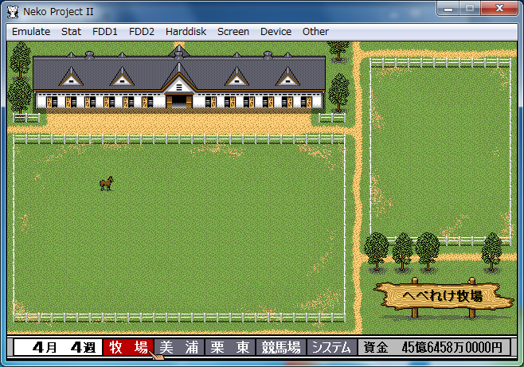
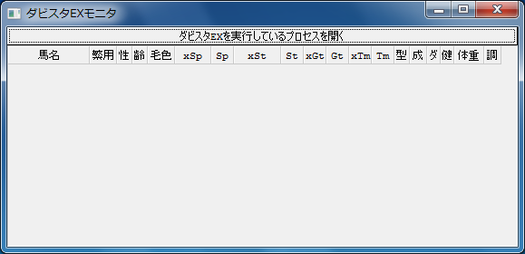
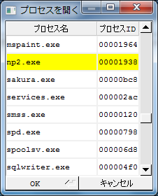
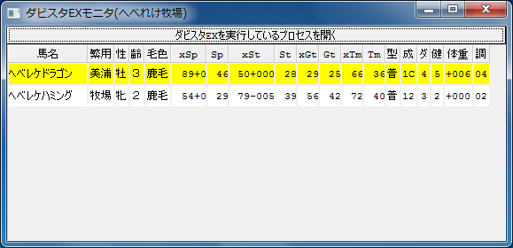
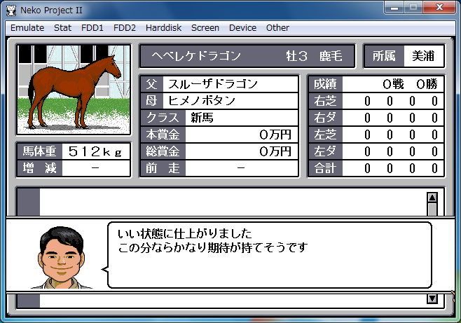
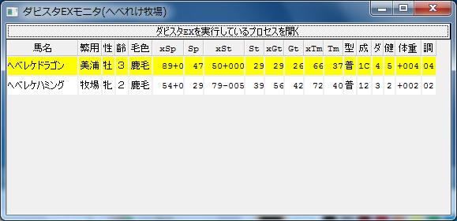

# ダビスタEXモニタ
PC-98エミュレータを起動して、ダビスタEXを実行します。  
  

dsexmon.exeを起動します。  
  
"ダビスタEXを実行しているプロセスを開く"ボタンを押します。  

実行しているプロセスの一覧が表示されます。  
  
エミュレータのプロセスを選び、"OK"ボタンを押します。  

ゲーム内の競走馬の一覧が表示されます。  
  
|項目|内容|
|:-:|:-|
|馬名|名前。|
|繁用|繁用されている場所。美浦、栗東、牧場のいずれか。|
|性|性別。牡、牝のいずれか。|
|齢|年齢。|
|毛色|毛色。 栗毛、鹿毛、黒鹿などのいずれか。|
|xSp|最大スピードと超晩成ボーナス。成長が超晩成の場合には最大スピードにボーナスがつく。|
|Sp|スピード。|
|xSt|最大スタミナと繁殖牝馬補正。繁殖牝馬のスタミナは最大気性により制限された上で、母父となる種牡馬の距離適性に応じて補正される。|
|St|スタミナ。|
|xGt|最大勝負根性。|
|Gt|勝負根性。|
|xTm|最大気性。|
|Tm|気性。|
|型|成長型。早、普、晩、持のいずれか。|
|成|成長。基本的に高いほど晩成となる。|
|ダ|ダート適性。高いほど適性がある。|
|健健|康。高いほど丈夫。|
|体重|現在の体重とベスト体重の差。|
|調|調子と怪我。絶好調は04。怪我は10以上。|

エミュレータで調教を行って、競走馬の能力を変化させます。  
  

調教した直後に表示が更新されます。  
  
